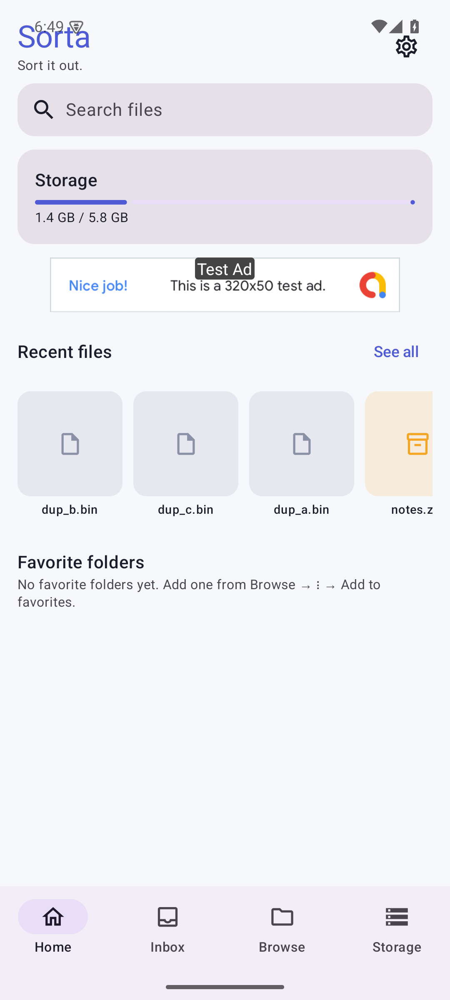
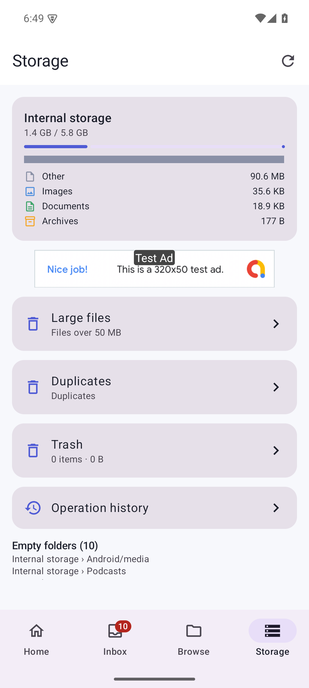
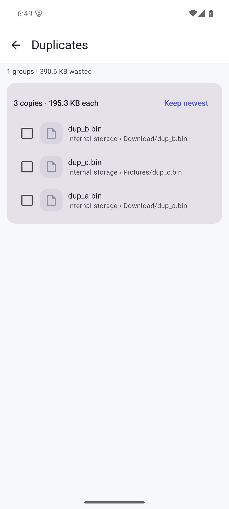
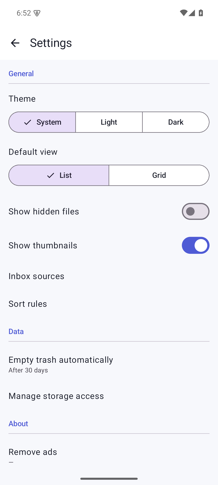
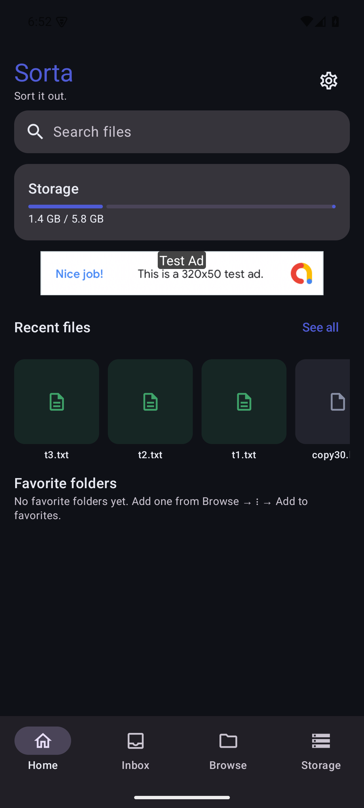

# Sorta

A file manager for Android 8+ whose differentiator is the **Inbox**: new files in
watched folders (Downloads, Screenshots, messaging-app dirs…) are collected in one
place, previewed, and tidied — rename + move — in three taps.

## Features

- **Inbox** — per-source scan (configurable watched folders, subfolders to 2 levels),
  New/Tidied tabs, day grouping, nav badge, Tidy flow (preview → destination → confirm),
  sort rules with preview.
- **Browse** — volumes, categories (MediaStore), list/grid, real thumbnails
  (Coil; video frames, PDF first page, APK icons), breadcrumbs, per-folder
  sort/view/scroll prefs, range selection, copy/move/rename/delete/share,
  conflict dialog (skip / keep-both / overwrite), batch rename patterns,
  ZIP compress & extract (zip-slip safe).
- **Storage** — incremental per-category usage scan, large files, duplicate
  detection (size → 64KB head → SHA-256), trash (restore / permanent delete /
  auto-purge), operation history.
- **Safety** — verified moves (temp file → fsync → size + SHA-256 → rename →
  delete source), cancellable ops via a foreground service with progress
  notification, undo for trash.
- **Extras** — favorites, recent files/locations, search with filters,
  dark/light theme, EN + ID strings, AdMob banner (test ids) removable via
  Play Billing "remove_ads".

## Screenshots

| Home | Storage | Duplicates |
|---|---|---|
|  |  |  |

| Settings | Home (dark) | Inbox (dark) |
|---|---|---|
|  |  |  |

## Build

```bash
./gradlew assembleDebug      # debug APK
./gradlew assembleRelease    # release APK (R8)
./gradlew bundleRelease      # AAB
```

See `docs/ARCHITECTURE.md` (stack/layout/data-safety rules),
`docs/TEST_PLAN.md` + `docs/TEST_RESULTS.md` (manual adb flows),
`docs/RELEASE.md` (signing, Play Console TODOs).
